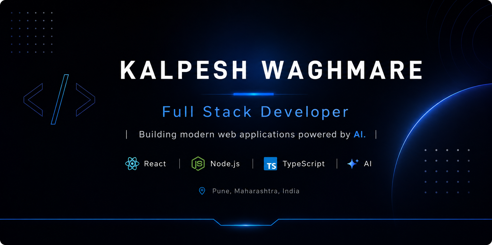

  

React • Node.js • TypeScript • Next.js

  

  

  

---

## 👨‍💻 About Me

I'm a **Full Stack Developer** focused on building modern, scalable web applications with clean architecture and intuitive user experiences.

I enjoy turning ideas into polished products and leveraging modern AI tools and APIs to build smarter, more efficient applications.

I'm continuously improving my engineering skills by building production-ready software and solving real-world problems.

---

## 🚀 Current Focus

- 🤖 Building AI-powered web applications
- 🌱 Learning Next.js and System Design
- ⚡ Exploring modern AI tools and developer workflows
- 🎯 Open to Full Stack Developer opportunities

---

## 🌟 Featured Projects

| Project | Description |
|----------|-------------|
| 🤖 **AI Resume Analyzer** | AI-powered ATS resume analysis and intelligent resume rewriting using Gemini AI. |
| 🌐 **Portfolio** | Modern portfolio showcasing projects, animations, and responsive UI. |
| 📖 **Mahanavika** | Editorial platform designed for a clean and engaging reading experience. |
| 🏠 **Airbnb Clone** | Full-stack booking platform with authentication and property listings. |

---

## 💻 Tech Stack

### Frontend

### Backend

### Database

### Tools & Platforms

---

  <b>Thanks for stopping by! 👋</b>
    
  <i>Always building. Always improving. 🚀</i>

